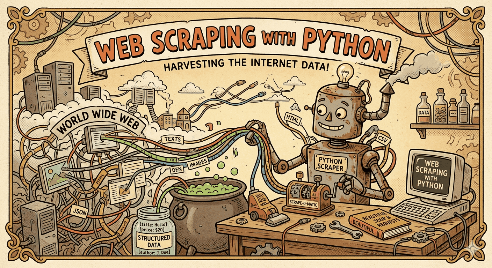

# Web Scraper Tutorial



This repository contains the code used in my web scraping tutorial videos. It includes three small scraping projects and one data-cleaning script.

## Projects

- `books_scrape/books_scrape.py` scrapes book data from Books to Scrape and exports it to CSV.
- `hacker_news_scrape/hacker_news_scrape.py` scrapes Hacker News posts for a specific date and exports them to CSV.
- `nba_schedule_scrape/scrape_via_api.py` fetches NBA standings data from the NBA stats API and saves it to CSV.
- `hacker_news_scrape/clean_data.py` cleans the Hacker News CSV output so numeric fields can be used more easily.

## Requirements

- Python 3.10+ recommended
- `pip`

## Setup

### 1. Clone the repository

```bash
git clone <your-repo-url>
cd web-scraper-tutorial
```

### 2. Create a virtual environment

Windows PowerShell:

```powershell
python -m venv .venv
.venv\Scripts\Activate.ps1
```

Command Prompt:

```bat
python -m venv .venv
.venv\Scripts\activate.bat
```

macOS / Linux:

```bash
python3 -m venv .venv
source .venv/bin/activate
```

### 3. Install dependencies

```bash
pip install -r requirements.txt
```

## How To Run

Run all commands from the repository root unless you want to adjust the paths.

### Books scraper

This script takes one argument: the output filename without the `.csv` extension.

```bash
python books_scrape/books_scrape.py books_output
```

Output:

```text
books_output.csv
```

### Hacker News scraper

This script takes:

- `date` in `YYYY-MM-DD` format
- `filename` for the output CSV without the `.csv` extension

Example:

```bash
python hacker_news_scrape/hacker_news_scrape.py 2026-03-08 hacker_news_mar_08
```

Output:

```text
hacker_news_mar_08.csv
```

### Clean the Hacker News data

This script takes:

- `filename` as the input CSV path
- `output_filename` as the cleaned CSV path

Example:

```bash
python hacker_news_scrape/clean_data.py hacker_news_mar_08.csv hacker_news_mar_08_clean.csv
```

Output:

```text
hacker_news_mar_08_clean.csv
```

### NBA API scraper

This script does not currently take CLI arguments. It writes the file `nba_standings.csv` to the current working directory.

```bash
python nba_schedule_scrape/scrape_via_api.py
```

Output:

```text
nba_standings.csv
```

## Suggested Workflow

```bash
python hacker_news_scrape/hacker_news_scrape.py 2026-03-08 hacker_news_mar_08
python hacker_news_scrape/clean_data.py hacker_news_mar_08.csv hacker_news_mar_08_clean.csv
```

## Notes

- Keep your virtual environment activated while running the scripts.
- If `python` does not work on your machine, try `py` on Windows or `python3` on macOS/Linux.
- The NBA script depends on the API remaining available and may stop working if the endpoint changes.
